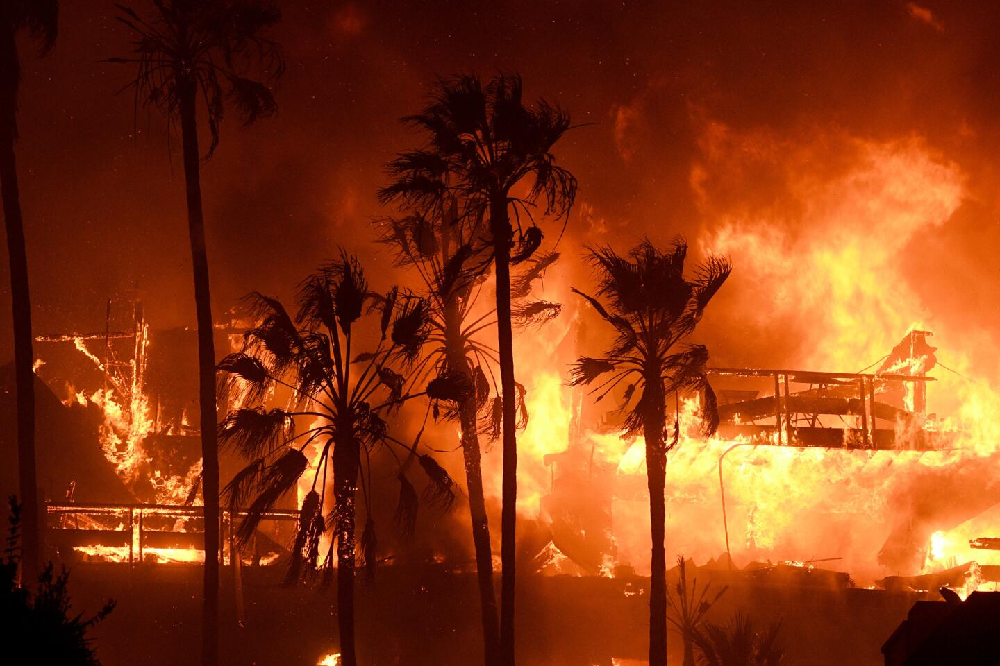

# False Color Mapping of 2017 Thomas Fire in SB County

## About: 

- Combine landsat dataset and outside shapefile to draw connections using false color imaging
- Practice using NetCDF dataset and dropping dimensions
- Visualize the lasting impact of secondary succession due to 2017 Thomas Fire using landsat data
- Filter a dataset and export a geometry shapefile based off filtered dataset

## Repository Structure

eds220-hwk4
│
├── data                        
│   ├──California_Fire_Perimters_(all).cpg
│   ├── California_Fire_Perimters_(all).dbf
│   ├── California_Fire_Perimters_(all).prj # Final choropleth map
│   ├── California_Fire_Perimters_(all).shp
│   ├── California_Fire_Perimters_(all).shp.xml
│   ├── California_Fire_Perimters_(all).shx
│   ├── landsat8-2018-01-26-sb-simplified.nc
│   ├── thomas_fire.cpg
│   ├── thomas_fire.dbf
│   ├── thomas_fire.prj
│   ├── thomas_fire.shp
│   ├──thomas_fire.shx
│
├── hwk4-task2-fire-perimeter-GRAZDA.ipynb # Jupyter notebook for analysis
├── hwk4-task2-false-color-GRAZDA.ipynb  # Jupyter notebook for analysis        
├── README.md  
├── LICENSE                      
├── .gitignore  
│
├── images/                       
│   ├── ny_state_spills_per_county.png  # Final choropleth map
│   ├── oil-spill.jpg             # Image used in the README

“Repository Structure” section. A concise description of what’s housed in the repository. This includes information about the repository structure or file organization.
“Data” section. Details regarding data access. Any necessary information on where data lives (e.g. is it housed in the repo, on a server, in a library / package etc.) and how to access it in order to run the code.
“References” section. In an appropriate, consistent format, including links, provide a reference to the course and any other sources that supported the development of the repository. Include formal references to the datasets. You can use the APA style to cite data sources as outlined here.